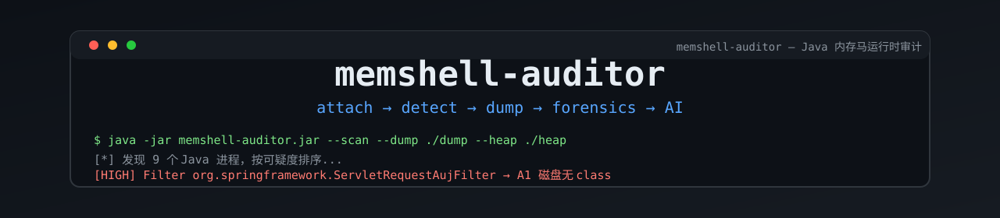

<p align="center">
  
</p>

# memshell-auditor 🔍
<p align="center">
  <a href="https://github.com/x7peeps/memshell-auditor"></a>
  <a href="https://github.com/x7peeps/memshell-auditor/releases"></a>
  <a href="https://github.com/x7peeps/memshell-auditor/blob/main/LICENSE"></a>
  <a href="https://github.com/x7peeps/memshell-auditor/releases"></a>
  <a href="https://img.shields.io/badge/Detection-7%2F7%20JMG%20payloads-red?style=for-the-badge"></a>
</p>

**Java 内存马运行时审计 Agent** —— attach 到目标 JVM，检测容器层（Filter/Servlet/Listener/Valve）与 JVM 层（Agent 型/defineClass 注入）内存马，并在检出后完成 dump / 反编译 / 回连 / 堆取证 / AI 分析的全链路闭环。

**零依赖**（JDK 8 编译，目标 JVM 兼容 JDK 8-26），**纯反射**实现（不依赖具体中间件类），**JSON/控制台双输出**。特征库随版本内置（rules/ 目录），在线更新 + 增量同步 + 自定义规则保护。

> ⚠️ 本工具仅用于授权环境下的安全应急响应、攻防演练与防御建设。请确保你的行为符合当地法律法规。

<table>
<tr><td><b>🔴 A1 强信号检测</b></td><td>容器组件（Filter/Servlet/Listener/Valve）注册的类在磁盘无对应 class 文件——主流生成器（JMG/MemShellParty）全部伪装 Spring 类名，但 A1 不受影响，实测 7/7 检出。</td></tr>
<tr><td><b>🕵️ 双程序防识别</b></td><td>--gen-agent 每次生成随机文件名/包名/类名的混淆取证程序，攻击者无法预判；取证程序不含 AI 能力防暴露，AI 仅在主程序。</td></tr>
<tr><td><b>⚡ 全自动扫描 --scan</b></td><td>无需知道 PID，自动枚举所有 Java 进程按可疑度排序审计，并发加速（--parallel）。</td></tr>
<tr><td><b>📡 实时监控 --live</b></td><td>attach 后新 defineClass 的类在定义瞬间捕获字节码，无需 retransform（retransform 失败的载荷也能取证）。</td></tr>
<tr><td><b>🛡️ 威胁情报集成</b></td><td>--analyze 自动查询回连 IP（微步 API + 启发式降级），C2/隧道端口自动判 HIGH。</td></tr>
<tr><td><b>🧠 hprof 堆解析</b></td><td>jmap 堆 dump 自动深度解析，retransform 失败的载荷类名/字节码从堆中恢复。</td></tr>
<tr><td><b>🤖 AI 增强分析</b></td><td>OpenAI 通用兼容接口（DeepSeek/通义/Ollama/vLLM），可配可跳过，离线自动降级本地规则。</td></tr>
<tr><td><b>📚 特征库生态</b></td><td>18 条内置规则（JMSH-001~018），在线更新 + 增量同步 + 自定义规则保护 + 众包特征提交。</td></tr>
</table>

---

## Quick Install

```bash
# 一键部署（下载 jar + 同步特征库 + 生成取证程序）
bash -c "$(curl -sL https://raw.githubusercontent.com/x7peeps/memshell-auditor/main/deploy.sh)"

# 或直接下载 Release
curl -L -o memshell-auditor.jar https://github.com/x7peeps/memshell-auditor/releases/latest/download/memshell-auditor.jar
```

环境要求：**JDK 8+**（JDK 21+ 附加 `--add-modules jdk.attach`）。

安装后：

```bash
java -jar memshell-auditor.jar --version   # 检查安装
java -jar memshell-auditor.jar --gen-agent ./agents --name-prefix system-diag  # 生成取证程序
```

---

## Quick Start

### 现场取证（取证人员）

```bash
# ① 目标系统上全自动扫描（无需知道 PID，自动识别可疑进程）
java -jar system-diag-2c4488.jar --scan --dump ./dump --heap ./heap

# ② 指定进程审计
java -jar system-diag-2c4488.jar <PID> --dump ./dump --heap ./heap

# ③ 实时监控：attach 后保持监听 60 秒，期间注入的内存马定义时捕获
java -jar system-diag-2c4488.jar <PID> --dump ./dump --live 60
```

### 报告分析（分析者机器）

```bash
# 无 AI 配置时自动降级本地规则分析，结尾引导配置
java -jar memshell-auditor.jar --analyze report.json

# 配置 AI 增强（OpenAI 兼容：DeepSeek/通义/Ollama 均可用）
java -jar memshell-auditor.jar --analyze report.json --ai-config ai.json
```

### 特征库管理

```bash
java -jar memshell-auditor.jar --rules update              # 拉取/更新特征库
java -jar memshell-auditor.jar --rules list                # 列出规则（提交人/标题）
java -jar memshell-auditor.jar --rules select --all        # 全选 / --id JMSH-001 逐个勾选
java -jar memshell-auditor.jar --submit --report report.json --author 你的名字 --auto-commit  # 贡献新特征
```

---

## 为什么需要它

内存马是 Web 攻防中最难检测的一类后门：

- **无文件落盘**：磁盘扫描/WAF/EDR 文件检测全部失效
- **类名伪装**：主流生成器（JMG/MemShellParty）生成的载荷全部伪装成 `org.springframework.*` 等框架类名，规避关键词检测
- **容器层扫描盲区**：Filter 型内存马注册在容器内部，不产生磁盘文件，传统 WebShell 扫描器无能为力

memshell-auditor 通过 **attach 到运行中的 JVM**，直接审计容器内部组件注册表与 JVM 已加载类，从根源判断"这个组件磁盘上到底存不存在"。

## 检测能力

### 检测维度（信号分级）

| 信号 | 检测项 | 判定 |
|---|---|---|
| **A1** | FilterDef/FilterConfig/Servlet/Listener/Valve 注册的类在磁盘无对应 class 文件 | 🔴 高度疑似（内存马核心特征） |
| **A2** | 容器组件注册数量异常（对比基线） | 🔴 需人工复核 |
| **A3** | 非系统 ClassLoader（自定义 Loader）加载恶意类 | 🟠 需人工复核 |
| **A4** | `-javaagent`/`-agentlib`/`JAVA_TOOL_OPTIONS` 注入 Agent / 可疑 ClassFileTransformer | 🔴 高度疑似 |
| **B1** | 类名特征（无包名/短随机名/恶意关键字） | 🟡 辅助信号 |
| **B2** | 已加载类名含可疑关键字 | 🟡 辅助信号 |

### 启发式检测（对抗未知变种）

不依赖已知特征，从字节码可读字符串提取**行为模式组合评分**：命令执行（Runtime.exec/ProcessBuilder）+ 动态加载（defineClass）+ 载荷解密（Base64/AES/Cipher）+ 网络回连（Socket/硬编码 IP）+ WebShell 回显（getParameter + 响应流）。**容器组件特征 + ≥2 个行为模式 → 判定可疑**，类名伪装无效。

### 实测检测结果（开源生成器真实载荷）

使用 **java-memshell-generator (JMG) v1.0.9** 生成真实内存马载荷，注入 Tomcat 9/10 靶场（defineClass 注入 WebappClassLoader + FilterDef 动态注册，与真实攻击链一致），**7/7 全部检出（100%）**：

| 载荷 | 工具 | 内存马类型 | 真实类名（伪装） | 容器 | 结果 |
|---|---|---|---|---|---|
| behinder-filter | 冰蝎 Behinder | JakartaFilter | `org.springframework.ServletRequestAujFilter` | Tomcat 10.1 | ✅ HIGH |
| godzilla-filter | 哥斯拉 Godzilla | JakartaFilter | `org.springframework.WhiteBlackListGbyfbdFilter` | Tomcat 10.1 | ✅ HIGH |
| antsword-filter | 蚁剑 AntSword | JakartaFilter | `org.springframework.AbstractMatcherVyjFilter` | Tomcat 10.1 | ✅ HIGH |
| suo5-filter | Suo5 隧道 | Filter | `org.springframework.SessionKqvcFilter` | Tomcat 9.0 | ✅ HIGH |
| behinder-listener | 冰蝎 Behinder | JakartaListener | `org.apache.logging.Log4jConfigEaeListener` | Tomcat 10.1 | ✅ HIGH |
| godzilla-valve | 哥斯拉 Godzilla | Valve | `org.apache.AbstractMatcherGbValve` | Tomcat 10.1 | ✅ HIGH |
| behinder-listener2 | 冰蝎 Behinder | Listener | `org.springframework.ContextLoaderDmasjListener` | Tomcat 9.0 | ✅ HIGH |

**关键结论**：主流生成器全部伪装类名（Spring/Logging/Apache 前缀 + 随机后缀），类名特征检测可被绕过；但 **A1 强信号（磁盘无 class 文件）不受影响**——无论类名伪装成什么，磁盘上都不存在对应 class 文件。

**误报控制**：正常业务 Filter（磁盘 WEB-INF/classes 存在）→ INFO；容器自带 Listener/Valve → INFO；JDK 类/数组类/自身类 → 白名单豁免。

完整测试记录见 [evidence/00-test-log.md](evidence/00-test-log.md)。

## 取证闭环

检出不是终点——还要能 dump、反编译、分析回连：

| 能力 | 说明 | 状态 |
|---|---|---|
| **Dump 落盘** | 可疑类字节码提取并写盘（磁盘类用资源流，动态类用 retransform 技巧） | ✅ 实测通过 |
| **反编译核心代码** | javap 反汇编 + 提取恶意核心片段（命令执行/网络/Base64 解密等） | ✅ 实测通过 |
| **回连分析** | 进程 ESTABLISHED 外连分析 + 字节码字符串中的 IP/域名提取 | ✅ |
| **Callback 汇总** | 疑似回连地址统一汇总为 HIGH Finding（供威胁情报查询） | ✅ |
| **堆取证** | jmap 跨平台 heap dump + hprof 深度解析（字符串/类名/恶意特征/字节码统计） | ✅ v2.5 |
| **威胁情报** | --analyze 自动查询回连 IP（微步 API + 启发式降级），隧道端口判 HIGH | ✅ v2.4 |

## 双程序架构（防取证识别）

为了防止内存马识别取证工具（固定进程名/类名特征会被攻击者预判并反制），本工具采用**双程序架构**：

| | 主程序 `memshell-auditor.jar` | 取证程序（--gen-agent 生成） |
|---|---|---|
| 位置 | 分析者机器 | 目标系统现场 |
| 文件名 | 固定 | 随机（`system-diag-2c4488.jar` 等） |
| 类名/包名 | `com.memshellauditor.*` | 每次随机（`net.jvm.check.*` 等） |
| 字符串特征 | memshell/auditor 等 | 中性化（javacore/classcore） |
| 规则匹配 | ✅ | ✅（内置规则引擎，离线可用） |
| **AI 能力** | ✅ | ❌（AI 仅在主程序） |
| 工作流 | 生成取证程序 → 分析取证报告 | 现场检测 + dump + 内存取证 + 规则分析 |

**工作流**：
1. 分析者机器：`--gen-agent` 生成混淆取证程序（每次特征随机，攻击者无法预判）
2. 现场：取证程序 attach 目标 JVM，检测 + dump + 堆内存取证 + 本地规则匹配分析，产出报告 JSON
3. 分析端：取证报告带回，`--analyze` 用 AI（OpenAI 兼容）增强分析恶意行为/回连/处置建议

## AI 增强分析（OpenAI 通用兼容）

```bash
# 配置方式1：JSON 配置文件（推荐，不硬编码密钥）
cat > ai.json <<'EOF'
{"base_url": "https://api.deepseek.com/v1", "api_key": "sk-xxx", "model": "deepseek-chat"}
EOF
java -jar memshell-auditor.jar --analyze report.json --ai-config ai.json

# 配置方式2：环境变量
AI_BASE_URL=https://api.deepseek.com/v1 AI_API_KEY=sk-xxx AI_MODEL=deepseek-chat \
  java -jar memshell-auditor.jar --analyze report.json
```

- **兼容一切 OpenAI 协议服务**：OpenAI / DeepSeek / 通义千问 / 智谱 / 本地 Ollama / vLLM
- **可配可跳过**：无配置自动降级本地规则分析（离线现场完全可用）
- **零依赖**：标准 `HttpURLConnection` 实现，不引入 SDK

示例：

```bash
$ java -jar memshell-auditor.jar 12345 /tmp/report.json

目标: /opt/app / java -jar app.jar
PID : 12345
JVM : 17.0.10
------------------------------------------
[01] [HIGH  ] Filter
     信号: A1
     类  : org.springframework.ServletRequestAujFilter
     Loader: ParallelWebappClassLoader (context: ROOT)
     原因: FilterDef 注册的类在磁盘无对应 class 文件（动态加载），高度疑似内存马
     证据: 核对 org.springframework.ServletRequestAujFilter 是否存在对应 class/jar
------------------------------------------
汇总: HIGH=1 MEDIUM=0 LOW=0 INFO=9 总计=10
```

### 作为 Agent 预挂载（事前巡检）

```bash
java -javaagent:/path/to/memshell-auditor.jar -jar app.jar
# premain 模式：启动时自动执行一次审计，配合基线比对
```

## 支持的中间件

- **Tomcat** 5-11（javax 与 jakarta 双命名空间，纯反射实现）
- **Spring Boot** 内嵌容器（StandardContext 同源）
- **类 Tomcat 国产中间件**（TongWeb/BES/InforSuite 等，容器 API 同源，部分需人工复核）
- 定位逻辑：`WebappClassLoader` 反查 + MBeanServer 辅助

## 判断标准体系

与应急响应方法论对齐（A=强信号，B=辅助信号）：

| 级别 | 含义 | 处置建议 |
|---|---|---|
| 🔴 HIGH | 命中 A1/A4 强信号 | 立即隔离 → 取证 → 清除 → 溯源 |
| 🟠 MEDIUM | 命中 A3/B1/B2 | 深度审计确认后升级 |
| 🟡 LOW | 无法解析组件 | 人工复核 |
| ⚪ INFO | 正常组件/信息 | 记录归档 |

## 特征库（rules/ 内置，类 Metasploit）

特征库已并入主仓库 `rules/` 目录（18 条规则，随版本发版），在线更新 + 增量同步 + 自定义保护 + 众包反哺：

```
rules/
├── JMSH-001~018.json   # 检测规则（模板: rules/template.json）
├── index.json          # 规则索引（提交人/标题/版本）
└── version             # 策略版本号
```

- **增量同步**：只更新官方规则，自定义规则（rules-custom/）永不误删
- **版本联动**：更新失败本地版本自动 bump，banner 显示 partial/failed 状态
- **众包反哺**：`--analyze` 发现未命中规则的高危项 → `--submit --auto-commit` 自动推送；push 失败降级 GitHub Issue
- **自定义规则保护**：官方 rules/ + 自定义 rules-custom/ 分离，更新只覆盖官方

## 项目结构

```
src/main/java/com/memshellauditor/
├── AgentMain.java           # agent 入口（premain/agentmain，含取证端规则分析）
├── AuditorMain.java         # 主程序 CLI（--gen-agent/--analyze/--rules/--submit）
├── ForensicMain.java        # 取证程序 CLI（--scan/pid/--live）
├── ScanRunner.java          # 全自动扫描编排（并发审计）
├── JvmScanner.java          # JVM 进程枚举 + 可疑度评分
├── detect/
│   ├── ContainerAuditor.java    # 容器组件审计（Filter/Servlet/Listener/Valve）
│   ├── AgentAuditor.java        # 启动参数/Agent 型检测
│   ├── TransformerAuditor.java  # ClassFileTransformer 审计（Agent 型内存马）
│   ├── ClassLoaderAuditor.java  # ClassLoader 血缘
│   ├── ClassFeatureAuditor.java # 类特征 + defineClass 检测
│   ├── HeuristicAuditor.java    # 未知内存马启发式检测（行为模式组合评分）
│   └── LiveTransformer.java     # 实时监控（定义时捕获字节码，v2.3+）
├── dump/
│   ├── ForensicsService.java    # 取证闭环编排（dump+反编译+回连）
│   ├── ClassDumper.java         # 字节码提取落盘（retransform 技巧）
│   ├── Decompiler.java          # javap 反汇编 + 核心代码提取
│   ├── NetworkAnalyzer.java     # 进程外连分析
│   ├── MemoryForensics.java     # 跨平台堆内存取证（jmap）
│   └── HprofParser.java         # hprof 深度解析（v2.5+）
├── ai/
│   ├── AiClient.java        # OpenAI 通用兼容客户端（零依赖）
│   └── AiAnalyzer.java      # AI 增强分析（引导式配置/跳过/降级）
├── threat/
│   └── ThreatIntelClient.java   # 威胁情报查询（微步 API + 启发式，v2.4+）
├── obf/
│   ├── ClassRewriter.java       # class 常量池重写器（字节码级混淆）
│   └── ObfuscateAgentGenerator.java # 混淆取证程序生成器
├── rules/
│   ├── Rule.java / RuleEngine.java / RuleStore.java / RuleUpdater.java / SubmitCollector.java
│   └── TinyJson.java            # 极简 JSON 解析器（零依赖）
├── report/
│   ├── Finding.java         # 发现项（level/signal/category）
│   └── Report.java          # 报告聚合（控制台/JSON/重建）
└── util/
    └── ReflectUtil.java     # 零依赖反射工具（含动态自排除）
```

## 局限性（坦诚声明）

1. **JMG 混淆载荷的 dump 限制**：Behinder 等规整载荷可完整 dump+反编译；Suo5 等经过激进 ASM 处理的载荷，JVM 拒绝 retransform（invalid class）——此类由 **--live 定义时捕获** + **hprof 堆解析**双兜底
2. **Agent 型内存马（Instrumentation transformer 注入）**：JDK 标准 API 无法枚举已注册的 ClassFileTransformer，通过 `getAllLoadedClasses` 类特征 + 内部字段探测间接检测（高版本 JDK 部分受限）
3. **回连分析噪声**：lsof 会混入本机其他服务的连接（代理/远程控制等），已集成威胁情报自动判定，特殊场景仍需人工复核
4. **容器定位依赖 WebappClassLoader**：极度精简的 classpath 模式（非 WAR 部署）可能定位不到 StandardContext
5. **运行时窗口**：attach 只能看到当前已加载的类；`--live` 模式可覆盖后续注入，attach 前已执行完的恶意行为不在检测范围

## Contributing

- **提 Issue/PR**：https://github.com/x7peeps/memshell-auditor/issues
- **贡献特征规则**：见 [CONTRIBUTING-RULES.md](CONTRIBUTING-RULES.md)，模板在 `rules/template.json`
- **开发记录/踩坑**：见 [evidence/20-v2-devlog.md](evidence/20-v2-devlog.md)

## License

MIT
